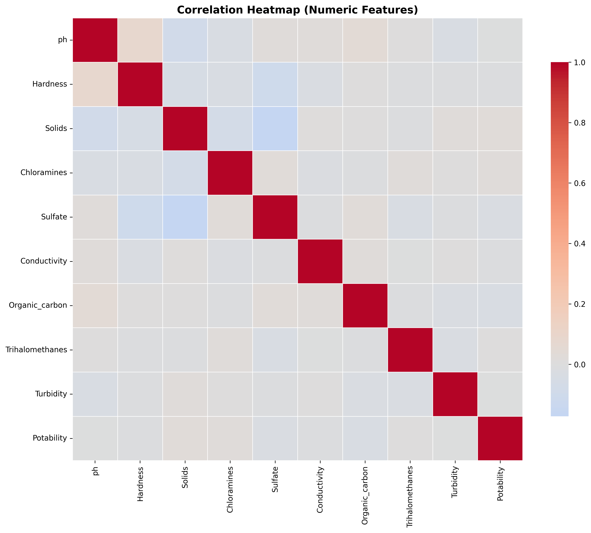
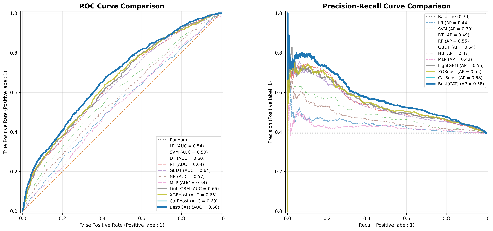
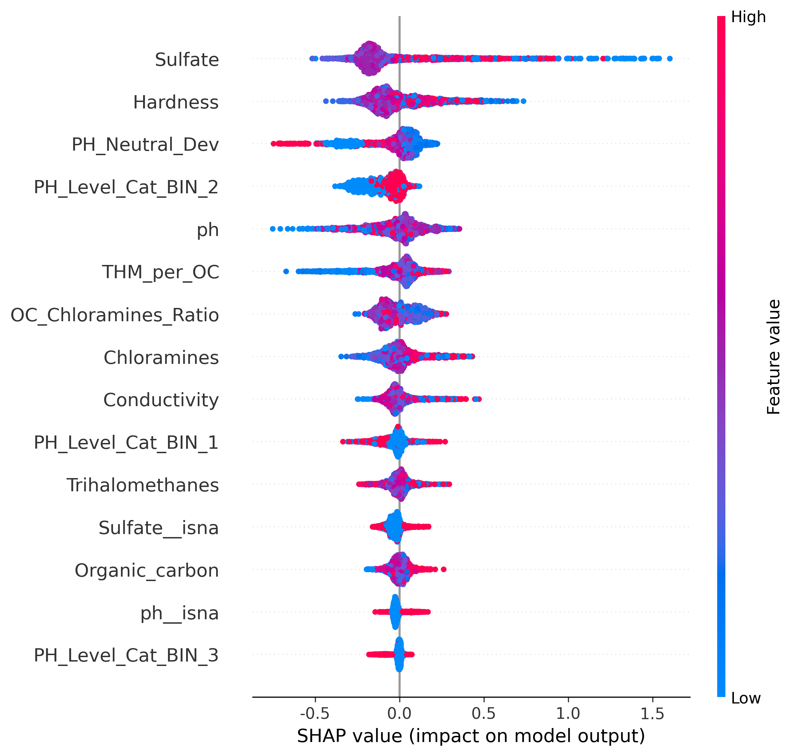
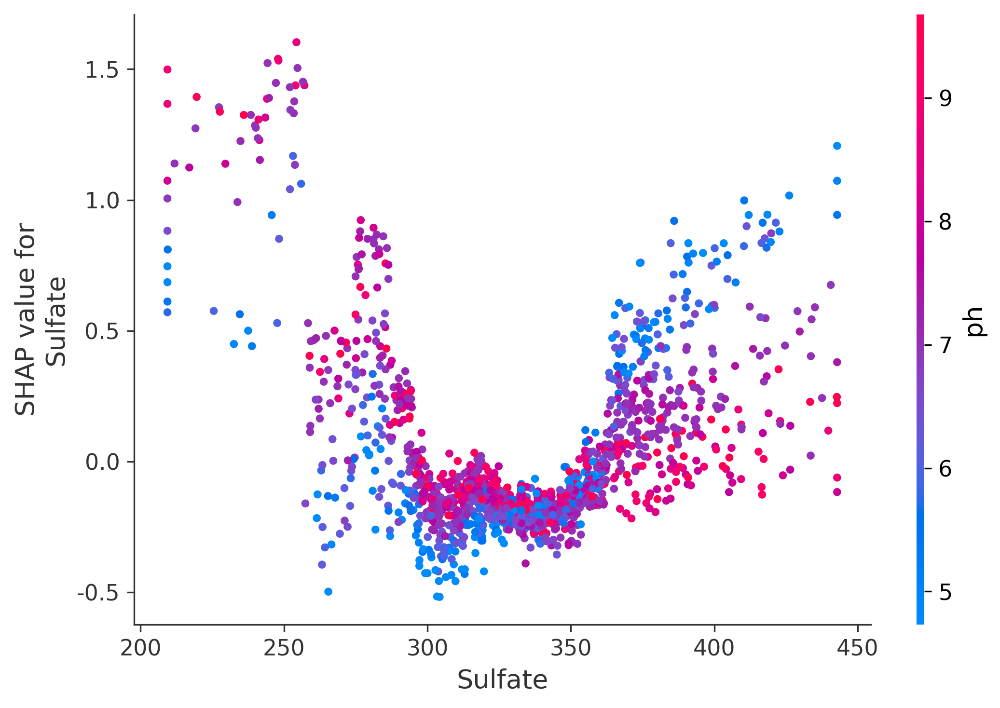
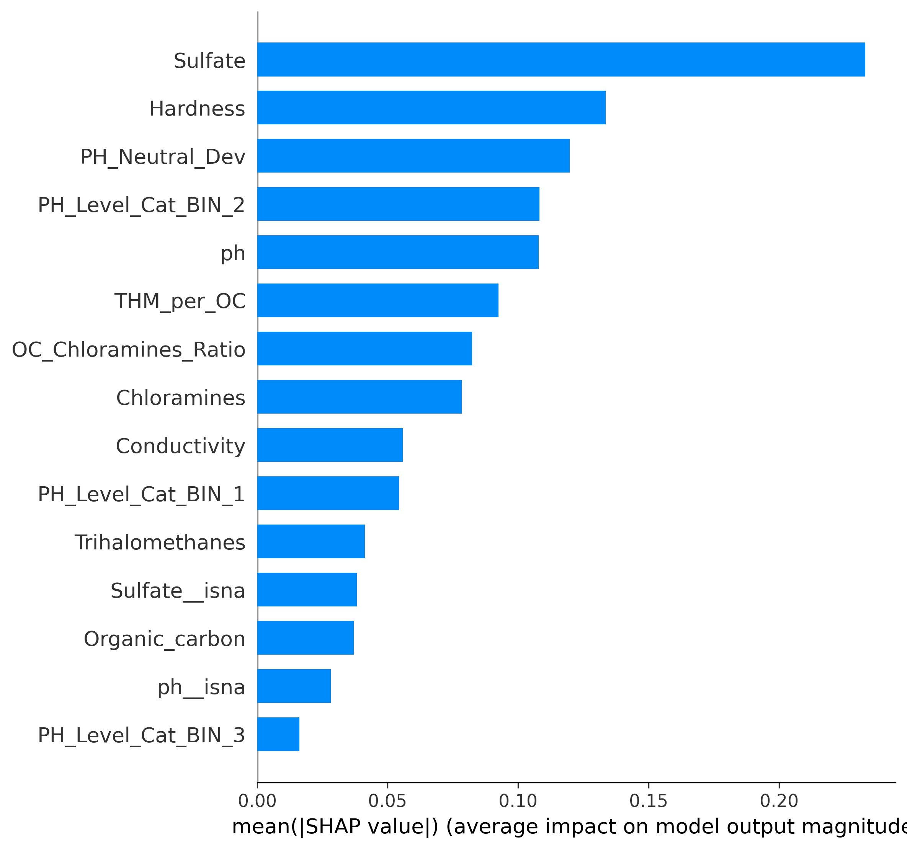

# 机器学习 × 环境工程：基于高级特征工程与多模型融合的水质预测研究

## 🔬 研究内容与创新点

### 1. 研究背景与现状
准确判定水质是环境监测与公共卫生领域的关键挑战。当前机器学习方法虽已成为主流，但仍普遍存在特征工程同质化以及预测性能与可解释性难以兼顾的问题。
> **⚠️ 严谨性声明**：
> 根据 **GB 5749-2022** 标准，饮用水安全的第一优先级为**微生物指标**（如大肠菌群）。本项目由于数据集局限性，侧重于基于理化参数的**工艺稳定性预测**，其结果应视为“理化合规性参考”，而非最终的生物学饮用安全判定。

### 2. 技术创新路径
1.  **数据预处理**：在对数据开展全面统计分析的基础上，执行了异常值修正、缺失值填充、特征编码等常规处理流程，确保数据分布的科学性。
2.  **高级特征工程**：基于环境化学理解将原始水质采样指标转化为具有物理化学可解释性的输入特征，包括：**pH酸碱度稳定性 (PH_Neutral_Dev)**、**硬度（钙镁离子集效）**、**硫酸盐浓度**、**氯胺杀菌效力 (OC_Chloramines_Ratio)**、**消毒副产物生成潜力 (THM_per_OC)**、**总有机碳 (TOC)** 以及**浊度波动**等，而非单纯通过增加无意义的统计特征与模型融合提升预测精度。
3.  **处理类别不平衡问题**：采用交叉验证框架，并在每一轮迭代中，仅对当前的训练折应用 **SMOTE** 等过采样算法，有效避免信息泄露并提升少数类识别率。
4.  **模型训练与评估**：基于**贝叶斯优化**框架，对 XGBoost、LightGBM、CatBoost 等多种主流机器学习模型进行高效调参；引入 **5 折交叉验证** 与**阈值搜索技术**优化分类性能。
5.  **可解释性分析**：基于 **SHAP 可解释性框架**，从全局与个体双维度对性能表现最优的单模型开展归因分析，并将结果反向用于指导特征工程优化。

## 📊 最终研究结果

1.  **模型表现**：对比实验结果表明，**CatBoost** 在验证集上达到最优性能，**ROC-AUC ≈ 0.68**。
2.  **特征增益**：整合业务驱动特征的 CatBoost 模型，其 ROC-AUC 相较于仅使用原始特征的基准模型提升了 **0.14**。
3.  **物理化学归因**：SHAP 分析显示，在本实验受限的数据空间内，**硫酸盐 (Sulfate)**、**pH 值** 以及 **硬度 (Hardness)** 占据了最高的特征重要性权重。这反映了理化平衡对工艺稳定性的统计学指示作用。

## 🖼️ 实验可视化展示（全五幅）

### 1. 指标关联分析 (Correlation Heatmap)
用于识别理化指标间的耦合关系，支撑特征选择的科学性。

### 2. 模型性能评估 (ROC & PR Curves)
展示各主流模型在 5 折交叉验证下的分类效能对比。

### 3. 全局贡献分析 (SHAP Summary Plot)
量化各特征对预测结果的边际贡献，识别核心工艺驱动因子。

### 4. 特征依赖分析 (SHAP Dependence Plot)
揭示核心指标（如 Sulfate）在不同浓度区间对水质判定影响的非线性趋势。

### 5. 个体决策路径 (SHAP Waterfall Plot)
针对单一样本的判定过程进行精准拆解，实现“预测-归因”的闭环。

## 🛠️ 可改进方向
针对目前数据集仅包含理化指标的局限性，未来应引入**总大肠菌群、致病菌等微生物指标**（饮用水安全第一优先级）以构建真正符合卫生预警标准的全维度模型。

